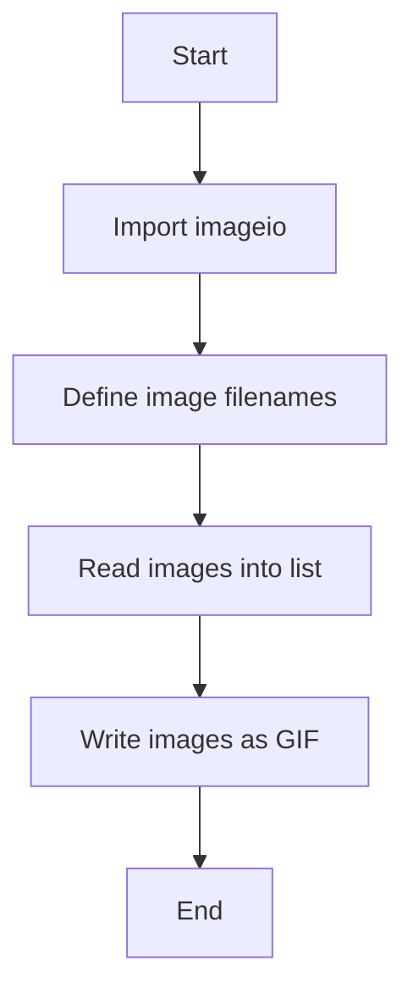

# GIF Image Creation Project

This project demonstrates how to create an animated GIF from multiple images using Python and the `imageio` library.

## How It Works

1. **Import the Library**: Uses `imageio.v3` for image reading and writing.
2. **Load Images**: Reads a list of PNG images (`team-pic1.png`, `team-pic2.png`).
3. **Create GIF**: Combines the images into a single GIF file (`team.gif`) with a set duration and infinite loop.

## Code Flow Diagram

## Requirements
- Python 3.x
- imageio library (`pip install imageio`)

## Output
- `team.gif` (animated GIF created from the input images)

---

**Author:** Hasan Atwi
